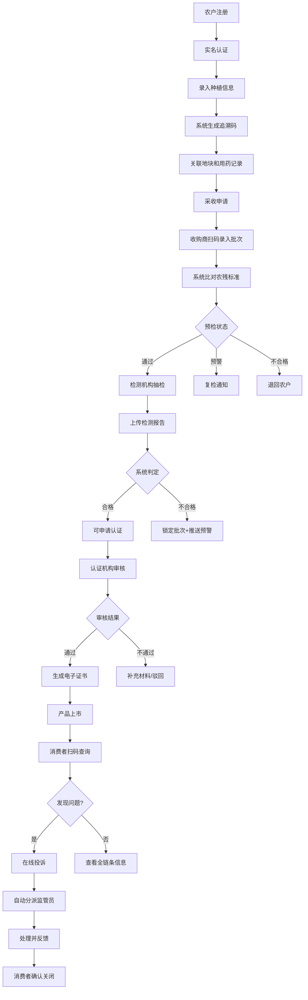

## 1. 产品概述

农产品质量安全追溯与品牌认证平台是一个覆盖农产品全生命周期的数字化追溯系统，连接农户、收购商、检测机构、认证机构、政府监管员和消费者六大角色，实现从田间到餐桌的全链条透明化管理。

本平台解决农产品质量安全追溯难、认证流程繁琐、监管效率低下、消费者信任缺失等核心问题，通过区块链级别的数据不可篡改性和实时消息推送机制，构建可信的农产品质量安全生态系统，提升农产品品牌价值和市场竞争力。

## 2. 核心功能

### 2.1 用户角色

| 角色 | 注册方式 | 核心权限 |
|------|---------|---------|
| 农户 | 实名认证+身份证审核 | 录入种植信息、申请追溯码、管理地块和用药记录、申请补贴、查看批次状态 |
| 收购商 | 企业认证+营业执照 | 扫码录入批次、查看预检状态、管理收购订单、追溯码查询 |
| 检测机构 | 资质认证+CMA资质审核 | 上门抽检、上传检测报告、查看检测历史、不合格批次预警 |
| 认证机构 | 官方认证+资质审核 | 发起有机/绿色认证审核、生成电子证书、管理认证档案 |
| 政府监管员 | 政府授权+身份核验 | 查看热力图、设置农残阈值、冻结批次、审批补贴、处理投诉、查看统计报表 |
| 消费者 | 手机号注册/扫码匿名 | 扫码查询追溯信息、在线投诉、投诉确认关闭、查看证书 |

### 2.2 功能模块

1. **登录与角色选择页**：多角色登录入口、身份验证、角色切换
2. **农户工作台**：种植信息管理、追溯码申请、地块管理、用药记录、补贴申请
3. **收购商工作台**：批次收购、扫码录入、预检比对、批次管理
4. **检测机构工作台**：抽检任务、报告上传、检测判定、预警处理
5. **认证机构工作台**：认证审核、证书生成、认证档案管理
6. **政府监管工作台**：数据热力图、阈值设置、批次冻结、投诉分派、补贴审批、统计报表
7. **消费者查询页**：扫码追溯、全链条信息展示、在线投诉、证书查看
8. **消息中心**：实时消息推送、消息分类、凭证下载
9. **统计报表页**：追溯启用率、认证通过率、补贴发放总额、监管对比分析

### 2.3 页面详情

| 页面名称 | 模块名称 | 功能描述 |
|---------|---------|----------|
| 登录页 | 角色选择模块 | 六种角色图标选择、账号密码登录、人脸识别验证 |
| 登录页 | 安全验证模块 | 双因素认证、登录日志、异常登录提醒 |
| 农户工作台 | 种植信息录入 | 作物品种、种植面积、播种日期、预估产量、地块GPS定位 |
| 农户工作台 | 追溯码生成 | 系统自动生成唯一追溯码、关联地块和用药记录、二维码打印 |
| 农户工作台 | 用药记录管理 | 农药名称、使用日期、用量、安全间隔期、合规性检查 |
| 农户工作台 | 补贴申请 | 自动计算补贴金额、生成申请单、审批状态追踪 |
| 收购商工作台 | 批次收购扫码 | 扫描追溯码、录入收购数量、质检照片、批次信息确认 |
| 收购商工作台 | 农残标准比对 | 自动比对国家农残标准、标记预检状态（通过/预警/不合格） |
| 收购商工作台 | 批次管理 | 批次列表、状态追踪、流向跟踪 |
| 检测机构工作台 | 抽检任务分配 | 监管员分派任务、上门抽检、样品采集记录 |
| 检测机构工作台 | 检测报告上传 | 检测项目、检测值、判定标准、报告PDF上传 |
| 检测机构工作台 | 系统自动判定 | 合格/不合格自动判定、不合格批次自动锁定、预警推送 |
| 认证机构工作台 | 认证审核 | 资料审核、现场核查、认证标准比对、审核结论 |
| 认证机构工作台 | 电子证书生成 | 审核通过自动生成带二维码证书、证书下载、真伪验证 |
| 政府监管工作台 | 数据热力图 | 区域合格率热力图、认证覆盖率热力图、投诉处理率热力图 |
| 政府监管工作台 | 阈值设置 | 农药残留超标阈值手动设置、超限自动冻结农户所有批次 |
| 政府监管工作台 | 投诉分派 | 按问题类型自动分派、处理进度追踪、消费者确认关闭 |
| 政府监管工作台 | 补贴审批 | 补贴申请审核、审批记录、打款确认 |
| 政府监管工作台 | 统计报表 | 每月1号自动生成监管对比报表、推送到手机端、多维度数据分析 |
| 消费者查询页 | 追溯查询 | 扫码或输入追溯码、全链条信息时间轴展示 |
| 消费者查询页 | 在线投诉 | 问题类型选择、描述、照片上传、投诉单号生成 |
| 消费者查询页 | 证书查看 | 有机/绿色证书展示、二维码验证、证书详情 |
| 消息中心 | 实时推送 | 检测结果通知、认证通过通知、投诉处理通知、补贴审批通知 |
| 消息中心 | 凭证下载 | 检测报告、认证证书、补贴凭证、投诉处理单下载 |

## 3. 核心流程

### 3.1 种植追溯流程
农户注册并通过实名认证 → 录入地块信息和种植计划 → 系统生成唯一追溯码 → 农户日常录入用药和施肥记录 → 达到采收期后发起采收申请 → 收购商扫码收购录入批次信息 → 系统自动比对农残标准标记预检状态 → 检测机构上门抽检上传报告 → 系统自动判定合格与否 → 合格批次可申请有机/绿色认证 → 认证通过生成电子证书 → 产品上市消费者扫码查询全链条信息

### 3.2 投诉处理流程
消费者扫码发现问题 → 选择问题类型填写投诉 → 系统生成投诉单号自动分派给对应区域监管员 → 监管员接收通知介入调查 → 协调相关责任方处理 → 处理完成后上传处理结果 → 系统推送处理结果给消费者 → 消费者确认关闭投诉 → 处理数据同步到监管统计报表

### 3.3 补贴申请流程
农户在线申请种植补贴 → 系统根据种植面积和历史产量自动计算补贴金额 → 生成电子申请单推送监管员审批 → 监管员审核资料和现场核查 → 审批通过后系统生成打款凭证 → 财务部门打款并上传凭证 → 农户收到补贴到账通知 → 补贴数据计入月度统计报表

### 3.4 月度监管报表流程
每月1号0点系统自动触发统计任务 → 统计各品类追溯启用率 → 统计认证通过率和有效证书数量 → 统计补贴发放总额和明细 → 生成多维度监管对比报表 → 推送到政府监管员手机端 → 支持在线查看和PDF导出

### 3.5 核心业务流程图

## 4. 用户界面设计

### 4.1 设计风格

**设计理念**：科技赋能农业，绿色安全可信

- **主色调**：深绿色 (#1B5E20) - 代表农业、安全、生命力
- **辅助色**：金黄色 (#F57F17) - 代表丰收、品质、认证
- **警示色**：红色 (#C62828) - 代表不合格、预警、冻结
- **成功色**：浅绿色 (#2E7D32) - 代表合格、通过、正常
- **中性色**：深灰 (#263238)、中灰 (#546E7A)、浅灰 (#ECEFF1)、白色 (#FFFFFF)

**字体选择**：
- 标题字体：Noto Serif SC - 庄重、专业、可信赖
- 正文字体：Noto Sans SC - 清晰、易读、现代
- 数字字体：JetBrains Mono - 数据展示更专业

**按钮风格**：
- 主按钮：圆角8px，绿色渐变，悬停时上浮+阴影加深，点击时微缩反馈
- 次要按钮：圆角8px，白色填充绿色边框，悬停时背景变浅绿
- 危险按钮：圆角8px，红色渐变，带脉冲动画警示效果
- 认证按钮：圆角8px，金色渐变，带微光动效凸显权威性

**布局风格**：
- 顶部导航栏固定，左侧角色专属菜单，右侧内容区域卡片式布局
- 数据看板采用网格布局，关键指标卡片悬浮展示
- 表单采用分组卡片设计，步骤流程采用时间轴展示
- 追溯信息采用垂直时间轴设计，清晰展示全生命周期

**图标风格**：
- 采用线性填充结合的图标风格，农业元素（稻穗、叶片、土地）与科技元素（二维码、盾牌、数据图表）融合
- 状态指示采用圆点+颜色编码，动态变化时有呼吸灯效

### 4.2 页面设计概述

| 页面名称 | 模块名称 | UI 元素 |
|---------|---------|---------|
| 登录页 | 角色选择 | 六大角色图标卡片，选中时缩放+边框高亮，背景为农场航拍图渐变遮罩 |
| 登录页 | 登录表单 | 半透明玻璃态卡片，输入框带图标，错误时抖动+红色边框 |
| 农户工作台 | 数据概览 | 顶部4个统计卡片（在种面积、待采收、追溯码数量、补贴金额），带数字滚动动画 |
| 农户工作台 | 种植信息 | 表单分组卡片，地图选点组件，文件上传区，提交按钮带进度条 |
| 农户工作台 | 追溯码管理 | 追溯码网格展示，每个卡片带二维码缩略图，点击放大可打印 |
| 收购商工作台 | 扫码收购 | 大型扫码框区域，摄像头实时预览，识别成功绿色边框+提示音 |
| 收购商工作台 | 预检结果 | 三色状态卡片（绿/黄/红），比对数据表格，不合格项高亮显示 |
| 检测机构工作台 | 抽检任务 | 地图标注抽检点，任务卡片带紧急程度标签，滑动显示操作按钮 |
| 检测机构工作台 | 报告上传 | 拖拽上传区域，检测项目动态表单，自动计算判定结果 |
| 认证机构工作台 | 认证审核 | 待审核列表卡片，审核进度条，资料预览区域，电子印章组件 |
| 认证机构工作台 | 证书生成 | 证书预览，金色边框，动态二维码，下载按钮带动效 |
| 政府监管工作台 | 热力图 | 中国地图/区域地图，颜色深浅表示指标高低，hover显示详情 |
| 政府监管工作台 | 阈值设置 | 滑动条+数值输入联动，农药列表搜索，保存时二次确认 |
| 政府监管工作台 | 投诉处理 | 投诉分类标签，分派下拉框，处理记录时间轴 |
| 消费者查询页 | 追溯信息 | 大型时间轴，每个节点带图标和状态，可展开查看详情 |
| 消费者查询页 | 投诉表单 | 问题类型图标选择，图片上传预览，提交后生成电子回执 |
| 消息中心 | 消息列表 | 分类标签页，未读消息红点，点击展开详情，下载按钮 |

### 4.3 响应式设计

- **桌面端（1920px）**：完整功能展示，四列数据卡片布局，侧边菜单展开
- **笔记本端（1366px）**：三列数据卡片布局，侧边菜单可折叠
- **平板端（768px）**：两列布局，顶部菜单折叠为汉堡按钮
- **手机端（375px）**：单列布局，底部Tab导航，热力图简化为列表+百分比展示
- **触摸优化**：所有可点击区域不小于44x44px，滑动操作流畅，支持下拉刷新

### 4.4 可视化交互设计

**热力图组件**：
- 采用ECharts地图组件，支持省级/市级/区级下钻
- 颜色渐变从浅绿到深绿表示合格率从低到高
- 红色闪烁点表示该区域有不合格批次预警
- 点击区域可查看详细数据和Top5问题品类

**追溯时间轴**：
- 垂直时间轴设计，每个节点有状态颜色标识
- 时间节点展开动画，从左向右滑入详情
- 用药记录节点显示安全警示图标
- 检测/认证节点可点击查看附件

**数据看板动画**：
- 页面加载时数字从0滚动到目标值，持续1.5秒
- 图表渐入动画，柱状图从底部升起，折线图从左向右绘制
- 新消息到达时顶部通知条滑入，带轻微振动反馈
- 批次状态变化时卡片闪烁对应颜色光效

**微交互动效**：
- 按钮hover：上浮2px + 阴影加深 + 轻微缩放(1.02)
- 卡片hover：Y轴上移4px + 投影增强
- 表单验证错误：输入框抖动 + 错误文字淡入
- 下拉选择：展开时高度过渡动画 + 选项渐入
