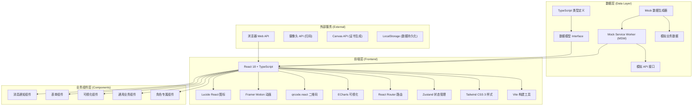
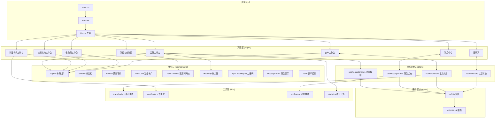
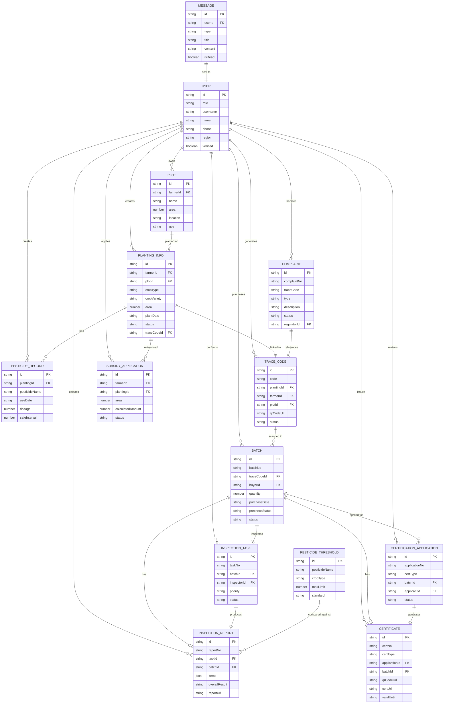

## 1. 架构设计



## 2. 技术描述

### 2.1 前端技术栈

- **核心框架**: React 18.2.0 + TypeScript 5.4.0
- **构建工具**: Vite 5.2.0
- **样式方案**: Tailwind CSS 3.4.0 + PostCSS + Autoprefixer
- **状态管理**: Zustand 4.5.0 (轻量级，简单易用)
- **路由管理**: React Router DOM 6.22.0
- **UI 组件**: 自定义组件库 + Headless UI (无样式组件)
- **图表可视化**: ECharts 5.5.0 (热力图、统计图表)
- **二维码生成**: qrcode.react 3.1.0
- **动画库**: Framer Motion 11.0.0
- **图标库**: Lucide React 0.360.0
- **HTTP 客户端**: Axios 1.6.0
- **表单处理**: React Hook Form 7.51.0 + Zod 3.22.0 (验证)
- **日期处理**: date-fns 3.3.0
- **Mock 方案**: Mock Service Worker 2.2.0 + Faker 8.4.0

### 2.2 初始化方式

使用 Vite 官方模板初始化 React + TypeScript 项目：
```bash
npm create vite@latest agri-trace-platform -- --template react-ts
```

### 2.3 数据持久化方案

- **LocalStorage**: 存储用户登录状态、主题偏好
- **IndexedDB** (可选): 存储大量离线数据（批次、追溯码）
- **SessionStorage**: 临时存储表单状态

### 2.4 后端 (模拟实现)

由于本项目采用纯前端模拟方式，使用 Mock Service Worker (MSW) 在浏览器端模拟 RESTful API，无需真实后端服务。所有业务逻辑在前端完成，数据存储在浏览器本地。

## 3. 路由定义

| 路由路径 | 页面名称 | 访问角色 | 功能说明 |
|---------|---------|---------|----------|
| `/` | 首页/角色选择 | 所有 | 角色选择、登录入口、平台介绍 |
| `/login` | 登录页 | 所有 | 账号密码登录、角色验证 |
| `/farmer/dashboard` | 农户工作台 | 农户 | 数据概览、快捷入口 |
| `/farmer/planting` | 种植信息管理 | 农户 | 录入/编辑种植信息 |
| `/farmer/trace-codes` | 追溯码管理 | 农户 | 查看追溯码、打印二维码 |
| `/farmer/pesticide` | 用药记录 | 农户 | 录入农药使用记录 |
| `/farmer/subsidy` | 补贴申请 | 农户 | 申请种植补贴、查看审批状态 |
| `/buyer/dashboard` | 收购商工作台 | 收购商 | 数据概览 |
| `/buyer/scan` | 扫码收购 | 收购商 | 扫描追溯码、录入批次 |
| `/buyer/batches` | 批次管理 | 收购商 | 查看收购批次、预检状态 |
| `/inspector/dashboard` | 检测机构工作台 | 检测机构 | 数据概览 |
| `/inspector/tasks` | 抽检任务 | 检测机构 | 查看抽检任务、上门抽检 |
| `/inspector/reports` | 检测报告 | 检测机构 | 上传报告、查看历史 |
| `/certifier/dashboard` | 认证机构工作台 | 认证机构 | 数据概览 |
| `/certifier/reviews` | 认证审核 | 认证机构 | 审核认证申请 |
| `/certifier/certificates` | 证书管理 | 认证机构 | 查看/下载电子证书 |
| `/regulator/dashboard` | 监管工作台 | 政府监管员 | 数据概览、热力图 |
| `/regulator/threshold` | 阈值设置 | 政府监管员 | 设置农残超标阈值 |
| `/regulator/complaints` | 投诉处理 | 政府监管员 | 分派投诉、处理跟进 |
| `/regulator/subsidy-approval` | 补贴审批 | 政府监管员 | 审批补贴申请 |
| `/regulator/reports` | 监管报表 | 政府监管员 | 查看月度统计报表 |
| `/consumer/trace` | 追溯查询 | 消费者 | 扫码/输入追溯码查询 |
| `/consumer/complaint` | 在线投诉 | 消费者 | 提交投诉、查看进度 |
| `/consumer/certificate` | 证书查看 | 消费者 | 查看有机/绿色认证证书 |
| `/messages` | 消息中心 | 所有 | 查看消息、下载凭证 |
| `*` | 404页面 | 所有 | 页面不存在提示 |

## 4. API 定义 (TypeScript 类型)

### 4.1 通用类型定义

```typescript
// 角色类型
type UserRole = 'farmer' | 'buyer' | 'inspector' | 'certifier' | 'regulator' | 'consumer';

// 通用状态
type Status = 'pending' | 'approved' | 'rejected' | 'processing';

// 批次状态
type BatchStatus = 'planted' | 'harvested' | 'purchased' | 'precheck_pass' | 'precheck_warning' | 
                   'precheck_fail' | 'inspecting' | 'qualified' | 'unqualified' | 'locked' | 'certified';

// 认证类型
type CertType = 'organic' | 'green' | 'gap';

// 问题类型
type ComplaintType = 'quality' | 'pesticide' | 'fake' | 'other';

// 检测结果
type InspectResult = 'qualified' | 'unqualified' | 'pending';

// 分页参数
interface PaginationParams {
  page: number;
  pageSize: number;
}

// 通用响应
interface ApiResponse<T> {
  code: number;
  message: string;
  data: T;
}

// 分页响应
interface PaginatedResponse<T> {
  items: T[];
  total: number;
  page: number;
  pageSize: number;
}
```

### 4.2 用户相关 API

```typescript
// 用户信息
interface User {
  id: string;
  role: UserRole;
  username: string;
  name: string;
  phone: string;
  idCard?: string;
  avatar?: string;
  region?: string;
  status: 'active' | 'inactive';
  createdAt: string;
  verified: boolean;
}

// 登录请求
interface LoginRequest {
  username: string;
  password: string;
  role: UserRole;
}

// 登录响应
interface LoginResponse {
  token: string;
  user: User;
}

// POST /api/auth/login
// 请求: LoginRequest
// 响应: ApiResponse<LoginResponse>

// GET /api/auth/profile
// 响应: ApiResponse<User>
```

### 4.3 农户相关 API

```typescript
// 地块信息
interface Plot {
  id: string;
  farmerId: string;
  name: string;
  area: number; // 亩
  location: {
    province: string;
    city: string;
    district: string;
    address: string;
    gps: { lat: number; lng: number };
  };
  soilType: string;
  createdAt: string;
}

// 种植信息
interface PlantingInfo {
  id: string;
  farmerId: string;
  plotId: string;
  cropType: string;
  cropVariety: string;
  area: number;
  plantDate: string;
  expectedHarvestDate: string;
  expectedYield: number; // 公斤
  actualYield?: number;
  status: 'planting' | 'growing' | 'ready' | 'harvested';
  traceCodeId?: string;
  createdAt: string;
}

// 用药记录
interface PesticideRecord {
  id: string;
  plantingId: string;
  farmerId: string;
  pesticideName: string;
  pesticideType: string;
  useDate: string;
  dosage: number;
  safeInterval: number; // 安全间隔期(天)
  operator: string;
  createdAt: string;
}

// 追溯码
interface TraceCode {
  id: string;
  code: string;
  plantingId: string;
  farmerId: string;
  plotId: string;
  qrCodeUrl: string;
  status: 'active' | 'used' | 'expired';
  createdAt: string;
  activatedAt?: string;
}

// 补贴申请
interface SubsidyApplication {
  id: string;
  farmerId: string;
  plantingId: string;
  area: number;
  yieldAmount: number;
  calculatedAmount: number;
  actualAmount?: number;
  status: 'draft' | 'submitted' | 'reviewing' | 'approved' | 'rejected' | 'paid';
  applicationDate: string;
  approvalDate?: string;
  paymentDate?: string;
  remark?: string;
  createdAt: string;
}
```

### 4.4 收购商相关 API

```typescript
// 批次信息
interface Batch {
  id: string;
  batchNo: string;
  traceCodeId: string;
  buyerId: string;
  farmerId: string;
  plantingId: string;
  quantity: number;
  unitPrice: number;
  totalAmount: number;
  purchaseDate: string;
  precheckStatus: 'pass' | 'warning' | 'fail' | 'pending';
  precheckDetails?: {
    pesticideResidue: { item: string; value: number; standard: number; result: string }[];
    overall: string;
  };
  status: BatchStatus;
  inspectionId?: string;
  certificateId?: string;
  createdAt: string;
}

// POST /api/batches/scan
// 请求: { traceCode: string; buyerId: string; quantity: number; unitPrice: number }
// 响应: ApiResponse<Batch>

// GET /api/batches
// 参数: PaginationParams & { buyerId?: string; status?: BatchStatus }
// 响应: ApiResponse<PaginatedResponse<Batch>>
```

### 4.5 检测机构相关 API

```typescript
// 检测任务
interface InspectionTask {
  id: string;
  taskNo: string;
  batchId: string;
  inspectorId: string;
  regulatorId: string;
  priority: 'low' | 'medium' | 'high' | 'urgent';
  status: 'pending' | 'assigned' | 'inspecting' | 'completed' | 'cancelled';
  sampleDate?: string;
  reportDate?: string;
  assignedAt: string;
  createdAt: string;
}

// 检测报告
interface InspectionReport {
  id: string;
  reportNo: string;
  taskId: string;
  batchId: string;
  inspectorId: string;
  items: {
    name: string;
    value: number;
    standard: number;
    unit: string;
    result: 'qualified' | 'unqualified';
  }[];
  overallResult: InspectResult;
  reportUrl: string;
  inspectorName: string;
  reportDate: string;
  createdAt: string;
}

// POST /api/inspection/reports
// 请求: Omit<InspectionReport, 'id' | 'reportNo' | 'createdAt'>
// 响应: ApiResponse<InspectionReport>
```

### 4.6 认证机构相关 API

```typescript
// 认证申请
interface CertificationApplication {
  id: string;
  applicationNo: string;
  certType: CertType;
  batchId: string;
  applicantId: string;
  certifierId?: string;
  materials: { name: string; url: string }[];
  status: 'draft' | 'submitted' | 'reviewing' | 'site_check' | 'approved' | 'rejected';
  reviewNotes?: string;
  certificateId?: string;
  submittedAt: string;
  reviewedAt?: string;
  createdAt: string;
}

// 认证证书
interface Certificate {
  id: string;
  certNo: string;
  certType: CertType;
  applicationId: string;
  batchId: string;
  holderName: string;
  productName: string;
  issueDate: string;
  validUntil: string;
  qrCodeUrl: string;
  certUrl: string;
  status: 'valid' | 'expired' | 'revoked';
  createdAt: string;
}

// POST /api/certificates/generate
// 请求: { applicationId: string; certifierId: string }
// 响应: ApiResponse<Certificate>
```

### 4.7 政府监管员相关 API

```typescript
// 投诉信息
interface Complaint {
  id: string;
  complaintNo: string;
  traceCode: string;
  consumerId?: string;
  consumerName: string;
  consumerPhone: string;
  type: ComplaintType;
  description: string;
  images: string[];
  region: string;
  regulatorId?: string;
  status: 'pending' | 'assigned' | 'processing' | 'resolved' | 'confirmed' | 'closed';
  processingLogs: {
    operator: string;
    action: string;
    remark: string;
    timestamp: string;
  }[];
  resolution?: string;
  createdAt: string;
  assignedAt?: string;
  resolvedAt?: string;
  confirmedAt?: string;
}

// 农残阈值设置
interface PesticideThreshold {
  id: string;
  pesticideName: string;
  cropType: string;
  maxLimit: number;
  unit: string;
  standard: string;
  createdBy: string;
  createdAt: string;
  updatedAt: string;
}

// 监管统计数据
interface RegulatorStats {
  passRateByRegion: { region: string; rate: number; total: number; pass: number }[];
  certCoverageByRegion: { region: string; rate: number; total: number; certified: number }[];
  complaintHandleRate: { region: string; rate: number; total: number; handled: number }[];
  monthlyData: {
    month: string;
    traceEnableRate: number;
    certPassRate: number;
    subsidyTotal: number;
  }[];
}

// GET /api/regulator/stats/heatmap
// 参数: { type: 'passRate' | 'certCoverage' | 'complaintRate'; region?: string }
// 响应: ApiResponse<RegulatorStats>

// PUT /api/regulator/thresholds/:id
// 请求: { maxLimit: number }
// 响应: ApiResponse<PesticideThreshold>
```

### 4.8 消费者相关 API

```typescript
// 追溯信息
interface TraceInfo {
  traceCode: string;
  batch: Batch;
  planting: PlantingInfo;
  plot: Plot;
  farmer: User;
  pesticideRecords: PesticideRecord[];
  inspectionReport?: InspectionReport;
  certificate?: Certificate;
  timeline: {
    stage: string;
    title: string;
    description: string;
    timestamp: string;
    status: string;
  }[];
}

// GET /api/consumer/trace/:code
// 响应: ApiResponse<TraceInfo>
```

### 4.9 消息通知 API

```typescript
// 消息类型
type MessageType = 'inspection_result' | 'certification' | 'complaint' | 'subsidy' | 
                   'warning' | 'system' | 'batch_status';

// 消息
interface Message {
  id: string;
  userId: string;
  userRole: UserRole;
  type: MessageType;
  title: string;
  content: string;
  relatedId?: string;
  relatedType?: string;
  attachmentUrl?: string;
  attachmentName?: string;
  isRead: boolean;
  createdAt: string;
  readAt?: string;
}

// GET /api/messages
// 参数: PaginationParams & { type?: MessageType; isRead?: boolean }
// 响应: ApiResponse<PaginatedResponse<Message>>

// PUT /api/messages/:id/read
// 响应: ApiResponse<{ success: boolean }>
```

## 5. 前端架构图



## 6. 数据模型

### 6.1 ER 图



### 6.2 初始化数据 (Mock Data)

系统启动时自动生成以下模拟数据：

1. **用户数据**：每种角色至少5个示例用户，包含完整的个人信息和认证状态
2. **地块数据**：20个以上不同区域的地块，包含GPS坐标
3. **种植数据**：30个以上种植记录，覆盖主要农作物（水稻、小麦、蔬菜、水果等）
4. **追溯码数据**：100个以上已生成的追溯码，关联种植和地块信息
5. **用药记录**：50条以上用药记录，包含不同农药类型
6. **批次数据**：40个以上收购批次，覆盖各种预检状态
7. **检测任务和报告**：30个检测任务，25份检测报告（含不合格案例）
8. **认证申请和证书**：20个认证申请，15张有效电子证书
9. **投诉数据**：25条投诉记录，覆盖各处理阶段
10. **阈值设置**：国家规定的主要农药残留限量标准
11. **消息数据**：每个角色至少10条历史消息
12. **统计数据**：近12个月的追溯启用率、认证通过率、补贴发放数据

所有模拟数据使用 Faker.js 生成，确保数据真实、多样，覆盖各种业务场景。
